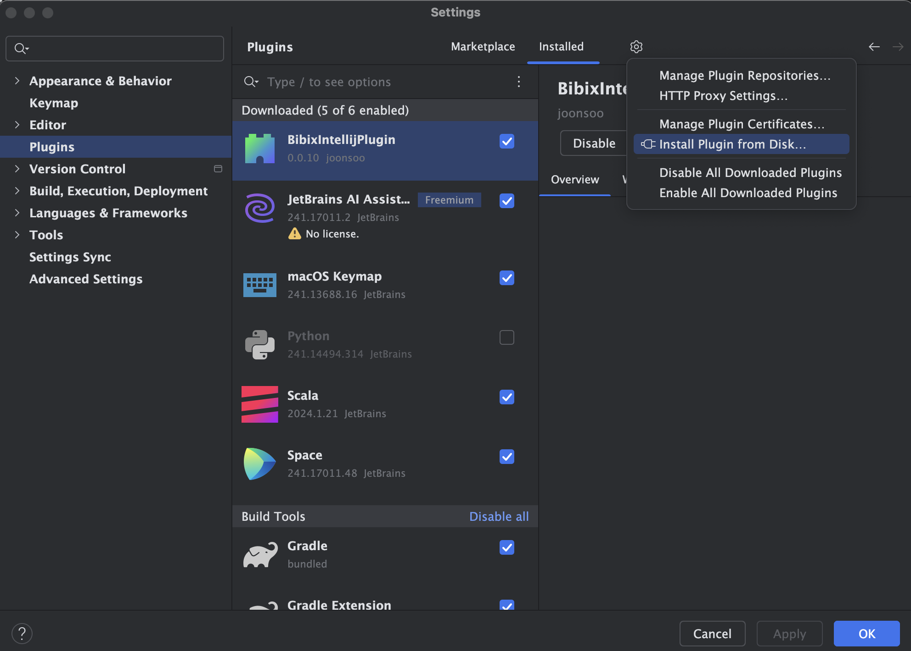
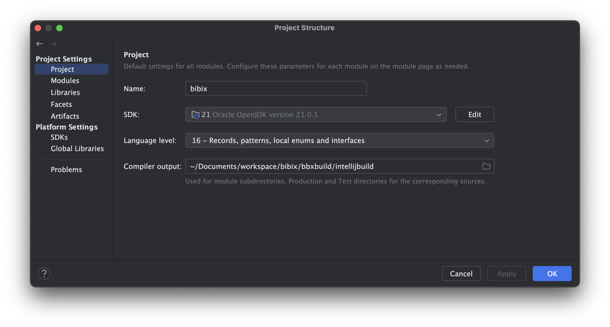
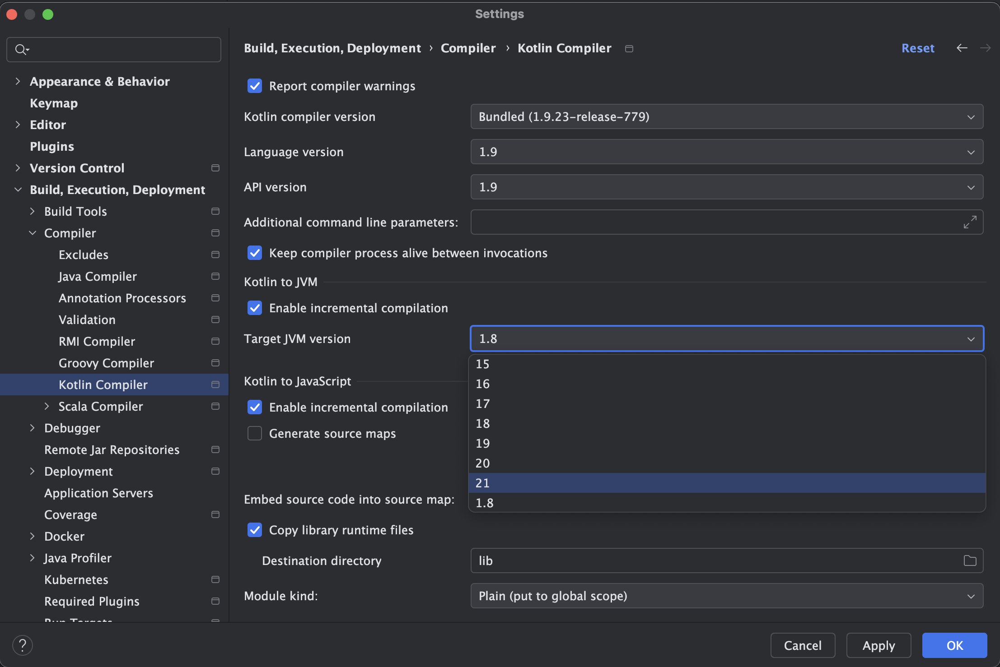
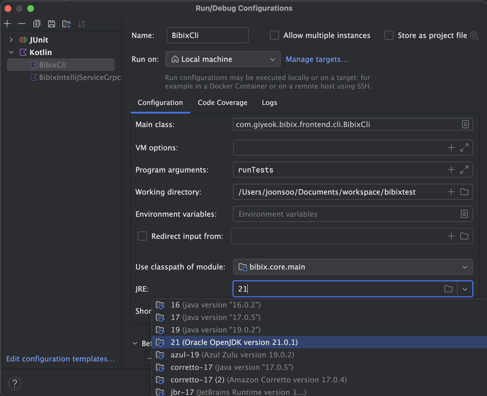

# IntelliJ에서 bibix 사용하기

## 설치

1. [최신 release 페이지](https://github.com/Joonsoo/bibix/releases/tag/0.8.1)에서 IntelliJ 플러그인(bibix-intellij-plugin-0.0.10.zip)과 IntelliJ 대몬(bibix-intellij-daemon-0.8.1-all.jar) 다운로드

2. IntelliJ를 열고 File > Settings... > Plugins에서 상단 톱니바퀴 버튼 누른 다음 "Install Plugin from Disk..." 클릭하고 1에서 다운로드 받은 zip 파일 선택해서 플러그인 설치

3. 플러그인을 사용하기 전에 `java -jar bibix-intellij-daemon-0.8.1-all.jar`를 실행해서 1에서 다운 받은 IntelliJ 대몬을 실행시킨 상태로 사용

4. 이제 IntelliJ에서 프로젝트를 새로 열기 위해 File > Open... 를 실행하는 경우 build.bbx 파일이 있으면 비빅스 프로젝트로 열 수 있고, 비빅스 프로젝트로 열면 오른쪽에 빨간색 숟가락 아이콘(숟가락이라고 그린거임..)을 눌러 Bibix 탭을 열어서 "Reload All Bibix Projects" 버튼 눌러서 새로 고침 가능

## Troubleshooting

### JVM 버전 때문에 뭔가 안되는 경우

bibix의 기본 플러그인 프로젝트인 [bibix-plugins](https://github.com/Joonsoo/bibix-plugins)에서는 java는 21 버전을, 코틀린을 1.9.20 버전을 기본으로 사용하고 있고, release 페이지에 업로드된 jar 파일들도 JRE 버전 21에서 컴파일되어 있다. 비빅스가 코틀린은 필요한 버전을 다운로드 받아서 사용하므로 신경 쓸 필요가 없지만 JVM은 최신 버전으로 설치한다.

### 메인 메뉴에서 Build > Build Project 등을 사용하는 경우 빌드를 저장할 디렉토리가 설정되어 있지 않다거나 SDK가 설정되지 않았다고 하는 경우
  1. "Project" 탭을 연다. 기본 단축키 Alt-1

  2. "Project" 보기 상태인지 확인하고, 맞으면 가장 위의 프로젝트 루트에서 오른쪽 클릭을 해서 "Open Module Settings" 버튼을 클릭한다. "Project Structure" 창이 열린다.

  3. 왼쪽에서 "Project"를 선택하면 다음과 같은 화면이 나온다.

  4. "Compiler output:" 이 비어있으면 현재 프로젝트 밑의 bbxbuild 밑에 ijbuild 와 같은 이름의 폴더를 생성해서 그 폴더를 지정해준다.

  5. SDK나 Language level이 비어있으면 설정해준다.

  6. 왼쪽에서 "Modules"를 선택해서 나오는 모듈 목록에서 각 모듈의 Language level이 잘 설정되어 있는지 확인한다.

### 코틀린 코드를 컴파일할 때 JVM 버전 때문에 빌드가 실패하는 경우
  1. File > Settings... > Build, Execution, Deployment > Compiler > Kotlin Compiler 에서 "Target JVM version"을 최신으로 바꿔본다.

### JVM 버전 때문에 실행이 안된다고 하는 경우

  1. IDE 상단의 실행/디버그 버튼 왼쪽의 "Run/Debug Configuration"를 클릭하고 "Edit Configurations..."를 선택한다.

  2. 실행할 Configuration을 선택하고 JRE 값이 잘 설정되어 있는지 확인한다.

